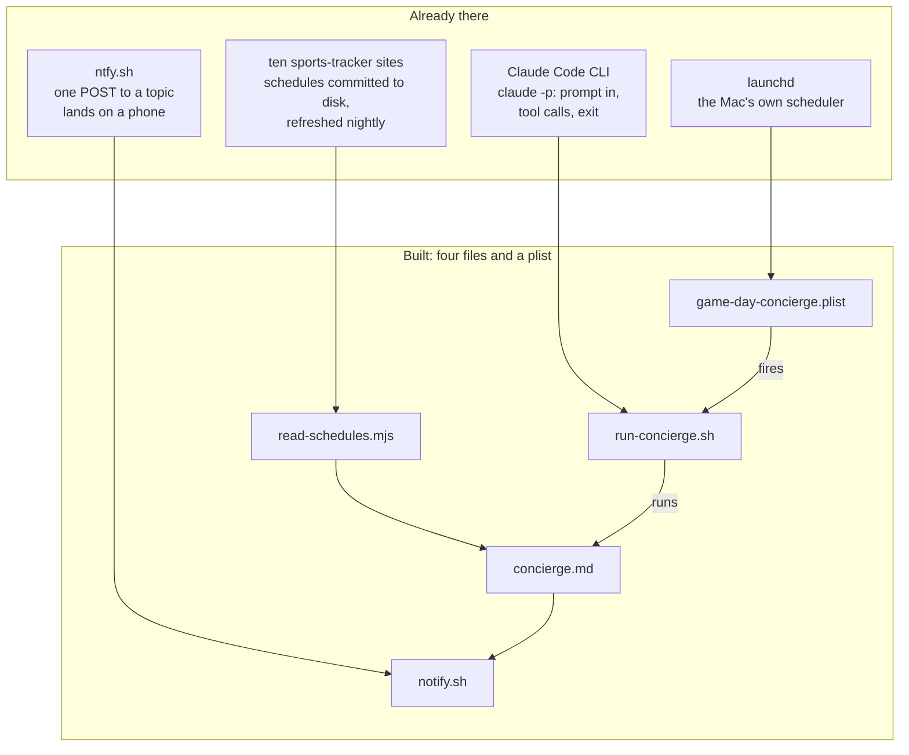
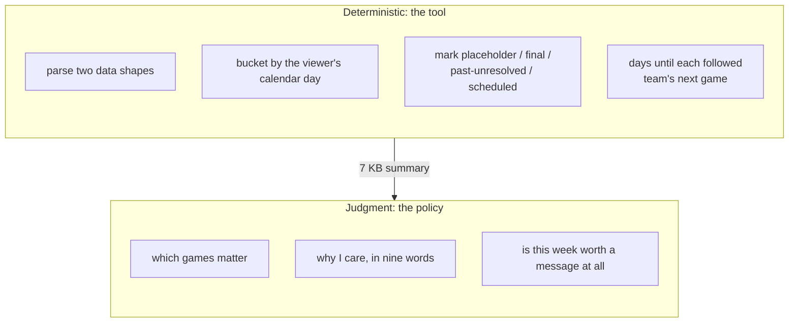

# How it fits together

The session this kit comes from spent most of its thirty minutes on shape, not code. This page is the shape: what existed before, what was built, and why each piece is where it is. `README.md` has the run-time diagrams; `examples/` shows every file in use.

## What existed before the session, and what was built

Nothing on the top row was made for the session. The build is the connections. The hub that lists the sites is https://ismayc.github.io/sports-trackers/.

## The two halves

The line between the halves is the one question: does this have one right answer? If yes, it goes in the tool, where it is computed once and the same way every week. If no, it goes in the policy, where a rule can bound it. An agent that parses 1.6 MB of JavaScript itself is expensive and wrong in a new way every run. An agent that reads a 7 KB summary and decides is cheap and wrong in ways you can write a rule about.

## The decisions, with the road not taken

| Decision | Chosen | Not chosen | Why |
| --- | --- | --- | --- |
| Who reads the data | A tool, once, deterministically | The agent reads the schedule files | Read literally, a finished World Cup is 104 unplayed matches, a third between teams that do not exist. The tool absorbs that once; the policy names it anyway so the rule survives a tool change. |
| What the policy is | Prose, a job description | A config file | A config can say "max 20 lines". It cannot say "zero picks is a good answer" or define real stakes. The reader reasons like a person; write to it like one. |
| What the agent may run | Two scripts by exact path, plus Read | `Bash(node:*)`, or any write tool | The repos back live websites. The property that makes the job safe to schedule is that nothing in the run can touch them. |
| How we know it worked | The digest file exists on disk | The agent says "sent" | A tool's stdout never reaches the log. A run once exited 0 with no message anywhere. |
| The clock | launchd | cron | Asleep at 7:00, launchd runs at the next wake; cron misses the week. launchd also needs a real PATH in the plist, failure mode number one. |
| The window | 7 days | 14 days | In season a week is a briefing and a fortnight is a phone book. The 14 came from a dead August. |
| A quiet week | Two honest sentences, then stop | Fill the space | The title promises never missing a game you care about, which is exactly why the agent has to be willing to send a short message. |

## Where to look

- `README.md`: the idea in one picture, and how to try it.
- `TECHNICAL.md`: the files, one run step by step, the tool's four states, scheduling, the allowlist.
- `examples/README.md`: the chain, file by file, from one real run.
- `WRITING-THE-POLICY.md`: the structure of the policy file and the practice behind each section.
