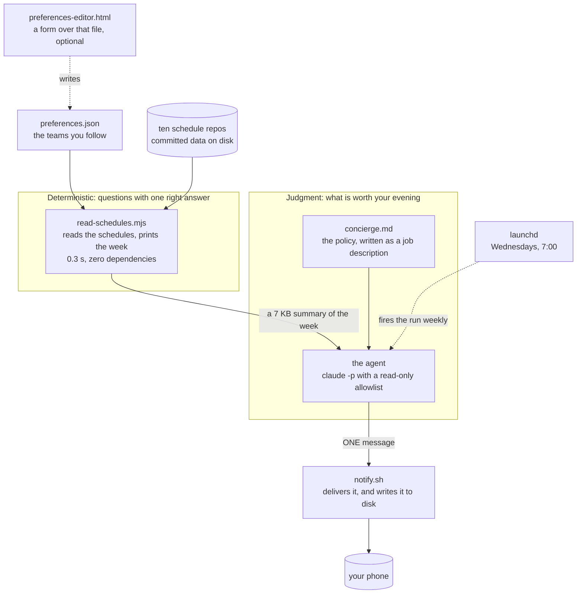

# Never Miss a Game: a sports concierge agent

One message a week about what is worth watching, built from schedules that already sit on disk. No app, no server, no API keys, no paid data. This is the kit from the O'Reilly session "Zero to Agent in 30 Minutes: Never Miss a Game" (September 16, 2026).

## The idea

Every sport I follow has a site that is good at its own game. None of them knows about my week. I wanted one message on my phone, only about games I care about, and quiet when there is nothing worth watching.



Two halves. Everything with one right answer (parsing, time zones, "is this a real fixture") lives in a small tool. Only what has no single right answer (which games matter, and why) lives in a written policy that the agent follows. Listing games is a script; deciding which four matter, and saying "nothing this week" when that is true, is judgment.

## Try it

You need a Mac or Linux machine with Node 18 or newer, git, and the Claude Code CLI (`claude`) installed and signed in. Nothing to install beyond that. The schedule data comes from the public repos behind https://ismayc.github.io/sports-trackers/, fetched by the first command below; nothing here depends on the author's computer.

```bash
git clone https://github.com/ismayc/never-miss-a-game.git
cd never-miss-a-game
./clone-viewers.sh                                               # fetch the schedule data
node read-schedules.mjs --days 7 --prefs preferences.json --all  # the data layer, on its own
git checkout complete                                            # the finished policy
./run-concierge.sh                                               # the whole agent, 90 to 160 seconds
```

The message prints in the terminal and is saved to disk. `examples/` shows what every step looks like: on `main`, what exists before the run (the preferences file and the tool's output); on `complete`, what the run produces (the transcript, the message, the delivery). Read along there before running anything. To see the preferences file as a form before you clone anything, open https://ismayc.github.io/never-miss-a-game/preferences-editor.html and click "Try the example".

## Make it yours

Edit the `followed` list in `preferences.json`: the sport, the team's abbreviation, its name, and a line on why you care. Run the data layer again and check your team appears under `Following` by full name. Then run the agent. That file is the only thing the agent knows about you.

To have the message reach your phone, install the free ntfy app, pick a long random topic name, and export it as `NTFY_TOPIC` before the run. "The phone" in `TECHNICAL.md` has the three steps and a one-line test. Without it, the message prints in the terminal and is saved to disk, and nothing leaves your machine.

If you would rather not edit JSON by hand, use the form at https://ismayc.github.io/never-miss-a-game/preferences-editor.html (the same page is `preferences-editor.html` in this repo; double-click it). Click Open and pick your `preferences.json`, tick your teams, type a line for each, set the snark slider, and Save. Chrome and Edge write the file back in place through the browser's file picker; any other browser downloads a `preferences.json` to put over the one in your checkout. It lists every team the ten repos know by the abbreviation the data uses. No server, nothing to install, and nothing leaves your machine. The agent never sees the page; it reads the file.

## Read next

- https://ismayc.github.io/never-miss-a-game/: the whole story on one page, for someone who has never built an agent.
- https://ismayc.github.io/never-miss-a-game/preferences-editor.html: the preferences form, with the session's own file one click away.
- `examples/README.md`: one real run, file by file. Inputs on `main`, outputs on `complete`.
- `HOW-IT-FITS-TOGETHER.md`: what already existed, what was built, and each decision with its road not taken.
- `WRITING-THE-POLICY.md`: how the policy file is structured, the practice behind each section, and a checklist for your own.
- `TECHNICAL.md`: the files, what happens in one run, the data traps the tool handles, scheduling, the phone, and the safety boundary.
- The data: https://ismayc.github.io/sports-trackers/
