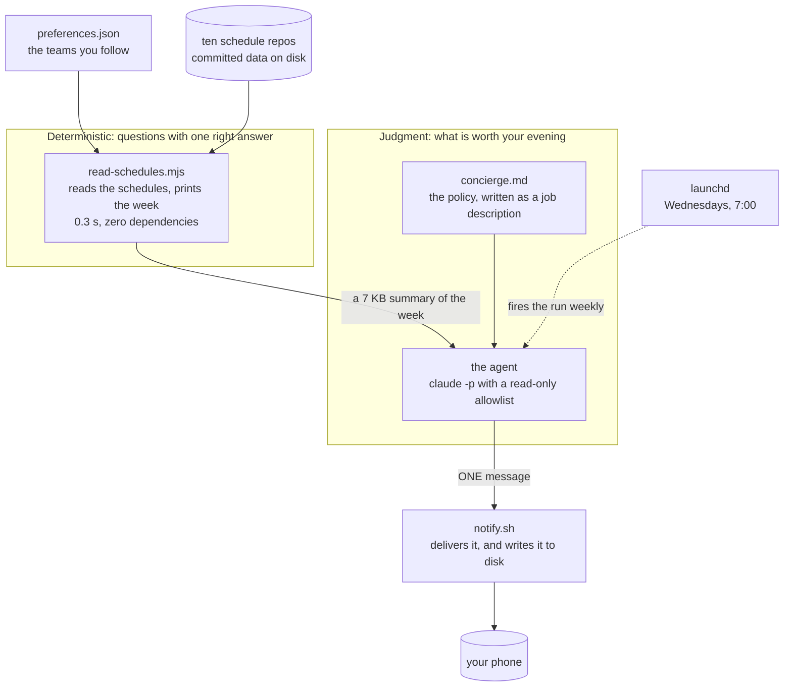

# Never Miss a Game: a sports concierge agent

One message a week about what is worth watching, built from schedules that already sit on disk. No app, no server, no API keys, no paid data. This is the kit from the O'Reilly session "Zero to Agent in 30 Minutes: Never Miss a Game" (September 16, 2026).

## The idea

Every sport I follow has a site that is good at its own game. None of them knows about my week. I wanted one message on my phone, only about games I care about, and quiet when there is nothing worth watching.



Two halves. Everything with one right answer (parsing, time zones, "is this a real fixture") lives in a small tool. Only what has no single right answer (which games matter, and why) lives in a written policy that the agent follows. Listing games is a script; deciding which four matter, and saying "nothing this week" when that is true, is judgment.

## Try it

You need Node 18 or newer, git, and the Claude Code CLI (`claude`) installed and signed in. Nothing to install beyond that.

```bash
git clone https://github.com/ismayc/never-miss-a-game.git
cd never-miss-a-game
./clone-viewers.sh                                               # fetch the schedule data
node read-schedules.mjs --days 7 --prefs preferences.json --all  # the data layer, on its own
git checkout complete                                            # the finished policy
./run-concierge.sh                                               # the whole agent, 90 to 160 seconds
```

The message prints in the terminal and is saved to disk. `examples/` shows what every step of that run looks like, from the preferences file to the delivered message, so you can read along before running anything.

## Make it yours

Edit the `followed` list in `preferences.json`: the sport, the team's abbreviation, its name, and a line on why you care. Run the data layer again and check your team appears under `Following` by full name. Then run the agent. That file is the only thing the agent knows about you.

## Read next

- `examples/README.md`: one real run, file by file.
- `HOW-IT-FITS-TOGETHER.md`: what already existed, what was built, and each decision with its road not taken.
- `WRITING-THE-POLICY.md`: how the policy file is structured, the practice behind each section, and a checklist for your own.
- `TECHNICAL.md`: the files, what happens in one run, the data traps the tool handles, scheduling, the phone, and the safety boundary.
- The data: https://ismayc.github.io/sports-trackers/
