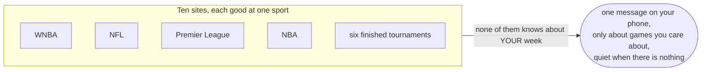
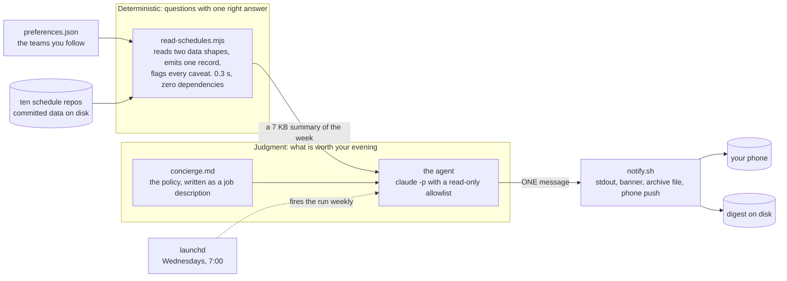
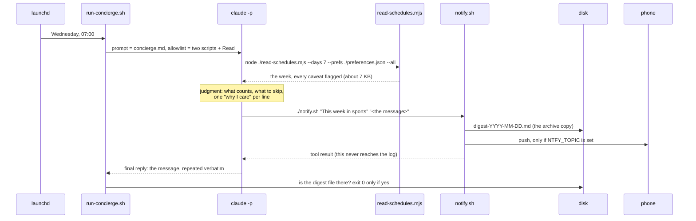
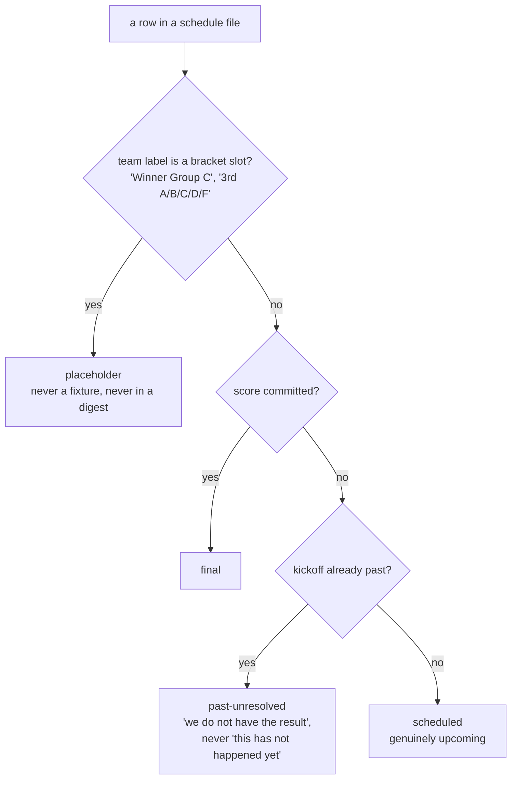
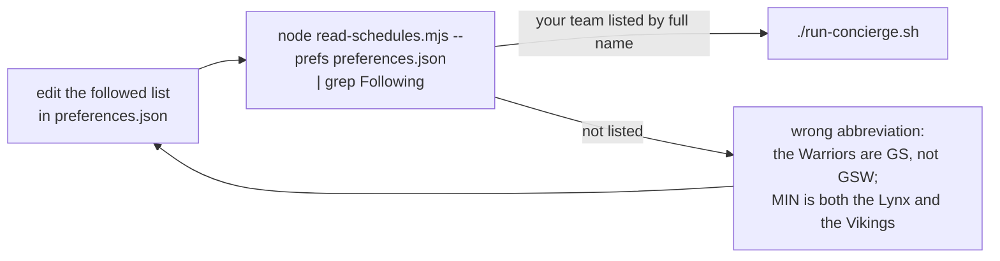
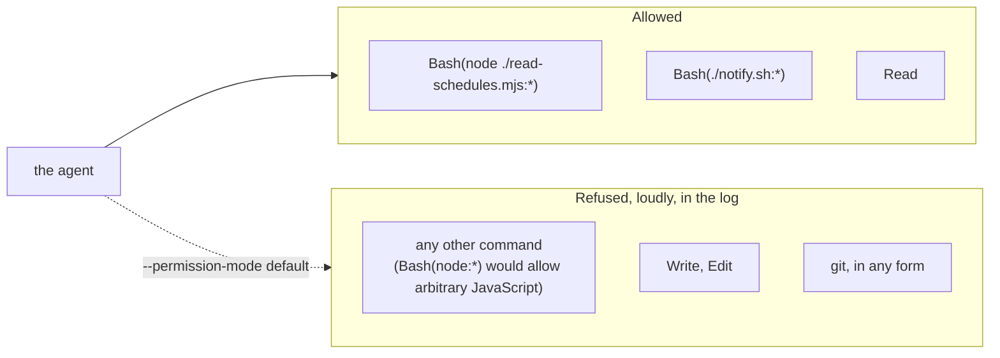
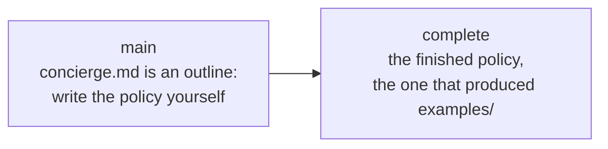

# Never Miss a Game: a sports concierge agent

One message a week about what is worth watching, built from schedules that already sit on disk. No app, no server, no API keys, no paid data. This is the kit from the O'Reilly session "Zero to Agent in 30 Minutes: Never Miss a Game" (September 16, 2026).

The diagrams below render on GitHub. In an editor preview they may show as code blocks.

## The problem



Listing games is a script. Deciding which four matter, and saying "nothing this week" when that is true, is judgment. Judgment is what the agent is for.

## How it fits together



Two halves. Everything with one right answer (parsing, time zones, "is this a real fixture", "days until the next game") lives in the tool. Only what has no single right answer (which games matter, and why) lives in the policy. Keeping them apart is the whole design.

## What happens in one run



Two rules in that picture were paid for by real failures. The agent repeats the message because a tool's output never reaches the job log. The runner checks that a digest file exists because an agent saying "sent" is not evidence.

## The files

| File | Half | What it does |
| --- | --- | --- |
| `preferences.json` | input | The teams you follow, keyed by `{sport, abbr}`, each with a `why` note. The only file you need to edit. |
| `read-schedules.mjs` | deterministic | Reads ten repos, normalizes them, buckets by your calendar day, prints the week. |
| `concierge.md` | judgment | The policy. An outline on `main`; the finished text on the `complete` branch. |
| `notify.sh` | delivery | Delivers one message four ways and writes it to disk. |
| `run-concierge.sh` | the run | `claude -p` with the allowlist, then checks the effect. |
| `game-day-concierge.plist` | the clock | launchd, Wednesdays at 7:00. Not installed by anything here. |
| `clone-viewers.sh` | setup | Fetches the ten schedule repos into the folder the tool expects. |
| `examples/` | see it | Every link of the chain from one real run: preferences in, message out. |

## What the tool protects the agent from



Read literally, the World Cup repo is 104 unplayed matches, a third of them between teams that do not exist, because results load at page time and are never committed. The tool marks every row with one of the four states above, buckets games by the day you see (a 5:20 PM Phoenix kickoff is 00:20Z the next day, and a naive read names the wrong evening), and prints its warnings instead of hiding them. The policy names the same traps anyway, so the rules survive a change to the tool.

## Run it

You need Node 18 or newer, git, and the Claude Code CLI (`claude`) installed and signed in. Nothing to `npm install`.

```bash
git clone https://github.com/ismayc/never-miss-a-game.git
cd never-miss-a-game
./clone-viewers.sh        # eleven shallow clones into ../sports-trackers

node read-schedules.mjs --days 7 --prefs preferences.json --all      # 1. the data layer alone
./notify.sh "Concierge test" "If you can see this, delivery works."   # 2. the notifier alone

git checkout complete     # the finished policy
./run-concierge.sh        # 3. the whole agent, headless: 90 to 160 seconds
```

To watch it work, run the same prompt interactively from this directory:

```bash
claude --allowedTools "Bash(node ./read-schedules.mjs:*)" "Bash(./notify.sh:*)" "Read" --permission-mode default "$(cat concierge.md)"
```

The `:*` after each script is load-bearing: "this exact script, any arguments". Without it the agent cannot pass `--days 7`. Run these in a plain terminal, never inside an open `claude` session. `CONCIERGE_NOW=2026-09-16 ./run-concierge.sh` runs for another date, which is how `examples/` was made.

## Make it yours



Every entry carries a sport because abbreviations collide across sports. A wrong abbreviation fails silently at run time and visibly here, so check here.

## Put it on a schedule

Replace the two placeholders in `game-day-concierge.plist` (`/PATH/TO/never-miss-a-game` and `/Users/YOUR-USER`; launchd does not expand `~`), then:

```bash
mkdir -p ~/Library/Logs/game-day-concierge
cp game-day-concierge.plist ~/Library/LaunchAgents/local.game-day-concierge.plist
launchctl bootstrap gui/$(id -u) ~/Library/LaunchAgents/local.game-day-concierge.plist
launchctl print gui/$(id -u)/local.game-day-concierge
```

Fire once: `launchctl kickstart -p gui/$(id -u)/local.game-day-concierge`. Remove: `launchctl bootout gui/$(id -u)/local.game-day-concierge`. Logs land in `~/Library/Logs/game-day-concierge/`. If the Mac is asleep at 7:00, launchd runs the job at the next wake, which is why this is not a cron line.

For the phone: install the ntfy app, subscribe to a long random topic, set `NTFY_TOPIC` to it in the plist. Anyone who knows the topic can read it; treat it as a password and never commit it.

## Why it is safe to leave running



The schedule repos back live websites. Nothing in this run can modify them, which is the property that makes it safe to schedule.

## Branches, and where to read next



- `examples/README.md`: the chain, file by file, from one real run.
- `HOW-IT-FITS-TOGETHER.md`: the resources that already existed, and each design decision with its road not taken.
- `WRITING-THE-POLICY.md`: the structure of the policy file, the practice behind each section, and a checklist for your own.
- The data: https://ismayc.github.io/sports-trackers/
