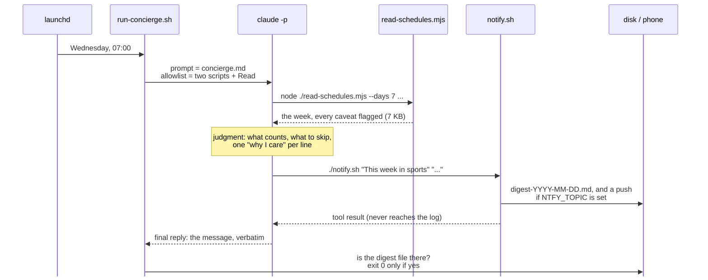
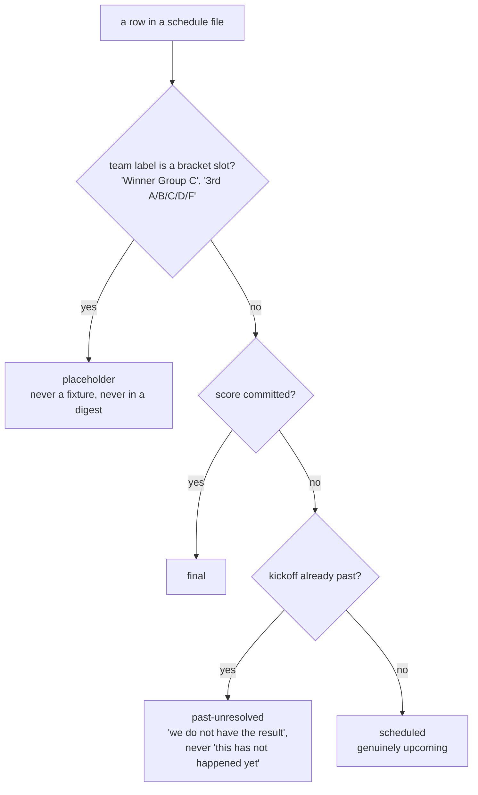
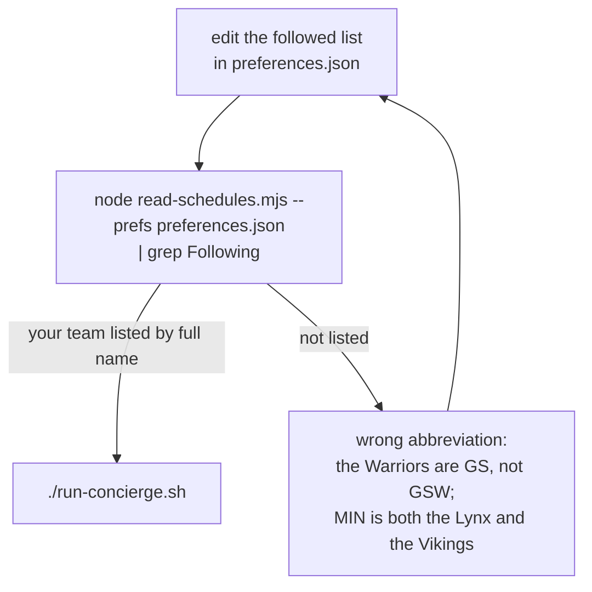

# Technical notes

The operational detail behind `README.md`: what each file does, what one run looks like, what the tool protects the agent from, how to schedule it, how to reach a phone, and why it is safe to leave running. The diagrams render on GitHub; an editor preview may show them as code.

## The files

| File | Half | What it does |
| --- | --- | --- |
| `preferences.json` | input | The teams you follow, keyed by `{sport, abbr}`, each with a `why` note. The only file you need to edit. |
| `preferences-editor.html` | input, optional | A form over `preferences.json`. Opens the file through the browser's file picker (Chrome or Edge), lists every team the ten repos know by the data's own abbreviation, and writes the file back in place. Nothing in the run reads it. |
| `read-schedules.mjs` | deterministic | Reads ten repos, normalizes two data shapes into one game record, buckets by your calendar day, prints the week. |
| `concierge.md` | judgment | The policy. An outline on `main`; the finished text on the `complete` branch. |
| `notify.sh` | delivery | stdout, a macOS banner, an archive file on disk, and an optional phone push. |
| `run-concierge.sh` | the run | `claude -p` with the allowlist, then checks that a digest file exists. |
| `game-day-concierge.plist` | the clock | launchd, Wednesdays at 7:00. Not installed by anything here. |
| `clone-viewers.sh` | setup | Fetches the ten schedule repos, plus the hub's helper modules, into the folder the tool expects. |
| `examples/` | see it | Every link of the chain from one real run. The inputs (preferences, tool reads, policy map) on `main`; the outputs (transcript, digest, delivery) join them on `complete`. |

## What happens in one run



Two rules in that picture were paid for by real failures. The agent repeats the message because a tool's output never reaches the job log. The runner checks that a digest file exists because an agent saying "sent" is not evidence.

To watch a run instead of reading its log, run the same prompt interactively from the repo directory:

```bash
claude --allowedTools "Bash(node ./read-schedules.mjs:*)" "Bash(./notify.sh:*)" "Read" --permission-mode default "$(cat concierge.md)"
```

The `:*` after each script is load-bearing: "this exact script, any arguments". Without it the agent cannot pass `--days 7` and the run dies on its first tool call. Run these commands in a plain terminal, never inside an open `claude` session.

Variations: `--tz Europe/London` moves every time in the digest; `--days 14` widens the window when the calendar is quiet; `--json` gives the machine-readable form. `CONCIERGE_NOW=2026-09-16 ./run-concierge.sh` runs for another date, which is how `examples/` was made.

## What the tool protects the agent from



Read literally, the World Cup repo is 104 unplayed matches, a third of them between teams that do not exist, because results load at page time and are never committed. The tool marks every row with one of the four states above, buckets games by the day you see (a 5:20 PM Phoenix kickoff is 00:20Z the next day, and a naive read names the wrong evening), and prints its warnings instead of hiding them. The policy names the same traps anyway, so the rules survive a change to the tool.

## Checking a follow



Every entry carries a sport because abbreviations collide across sports. A wrong abbreviation fails silently at run time and visibly here, so check here.

## Put it on a schedule

This part is macOS only; on Linux, a cron entry or a systemd timer that runs `run-concierge.sh` does the same job (mind the PATH, as below). Replace the two placeholders in `game-day-concierge.plist` (`/PATH/TO/never-miss-a-game` and `/Users/YOUR-USER`; launchd does not expand `~`), then:

```bash
mkdir -p ~/Library/Logs/game-day-concierge
cp game-day-concierge.plist ~/Library/LaunchAgents/local.game-day-concierge.plist
launchctl bootstrap gui/$(id -u) ~/Library/LaunchAgents/local.game-day-concierge.plist
launchctl print gui/$(id -u)/local.game-day-concierge
```

Fire once: `launchctl kickstart -p gui/$(id -u)/local.game-day-concierge`. Remove: `launchctl bootout gui/$(id -u)/local.game-day-concierge`. Logs land in `~/Library/Logs/game-day-concierge/`: `run-YYYY-MM-DD.log` is everything the agent said, `digest-YYYY-MM-DD.md` is just the message. If the Mac is asleep at 7:00, launchd runs the job at the next wake, which is why this is not a cron line. The plist carries a real PATH because launchd's default one has neither Homebrew nor a Node version manager on it, which is failure mode number one for scheduled agents.

## The phone

Install the ntfy app, subscribe to a long random topic string, and set `NTFY_TOPIC` to that string in the plist's `EnvironmentVariables` (or export it in the shell that runs the agent). Anyone who knows the topic can read it, so treat it as a password and never commit it. With it unset, the run is fully offline: terminal, banner, and the archive file.

## Why it is safe to leave running

The allowlist in `run-concierge.sh` is the security boundary.

Allowed:

- `Bash(node ./read-schedules.mjs:*)`
- `Bash(./notify.sh:*)`
- `Read`

Refused, loudly, in the log:

- any other command (`Bash(node:*)` would have allowed arbitrary JavaScript; `Bash(*)` arbitrary anything)
- `Write`, `Edit`
- `git`, in any form

With `--permission-mode default`, anything off the list is refused instead of silently escalated, and in a headless run there is nobody to approve a prompt. The schedule repos back live websites; nothing in this run can modify them, which is the property that makes it safe to schedule. The runner also verifies the effect rather than the report: `notify.sh` writes the digest to disk itself, and the run fails if that file does not exist, whatever the agent said.

## Branches

- `main`: the starting point. The kit with `concierge.md` as an outline, and in `examples/` only what exists before a run.
- `complete`: the built-out result. The finished policy, and `examples/` gains what the run produced from it: the transcript, the digest, the delivery.
