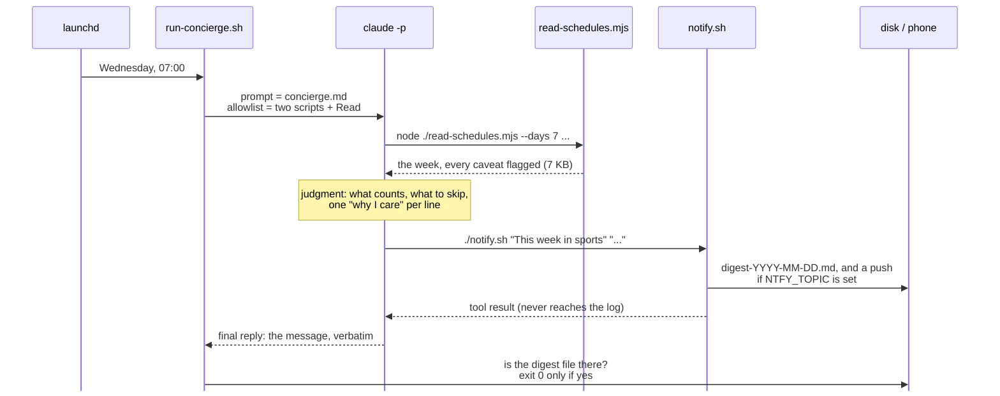
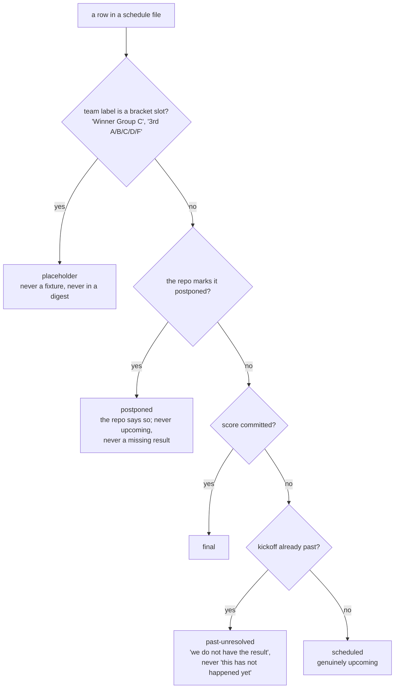
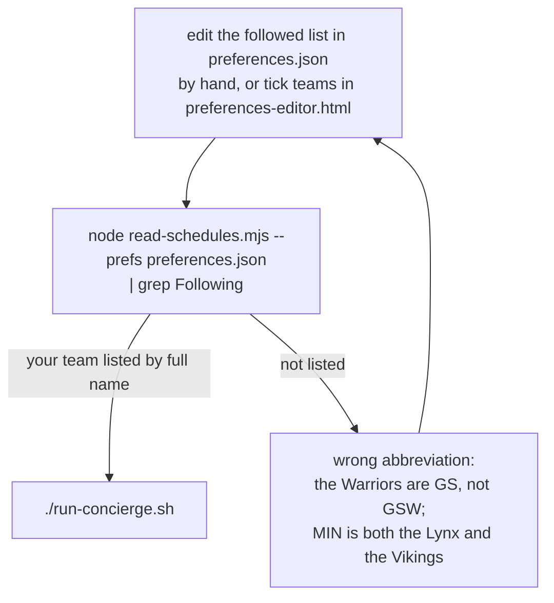

# Technical notes

The operational detail behind `README.md`: what each file does, what one run looks like, what the tool protects the agent from, how to schedule it, how to reach a phone, and why it is safe to leave running. The diagrams render on GitHub; an editor preview may show them as code.

## The files

| File | Half | What it does |
| --- | --- | --- |
| `preferences.json` | input | The teams you follow, keyed by `{sport, abbr}`, each with a `why` note. The only file you need to edit. |
| `preferences-editor.html` | input, optional | A form over `preferences.json`. Opens the file through the browser's file picker (Chrome or Edge), lists every team the ten repos know by the data's own abbreviation, and writes the file back in place. Nothing in the run reads it. |
| `.github/workflows/read-schedules.yml` | input, optional | GitHub Actions. Every six hours, and at 13:00 UTC, it runs `read-schedules.mjs` on GitHub's machines with the policy's flags and commits the text and JSON output under `docs/reads/`, which GitHub Pages serves. The form's "Read this week's schedules" button fetches that, so seeing the week needs nothing running on your computer. The deterministic half only: no Claude call, no key. It commits to `main`, so pull before you push. |
| `read-schedules.mjs` | deterministic | Reads ten repos, normalizes two data shapes into one game record, buckets by your calendar day, prints the week. |
| `concierge.md` | judgment | The policy. An outline on `main`; the finished text on the `complete` branch. |
| `notify.sh` | delivery | stdout, a macOS banner, an archive file on disk, and an optional phone push. |
| `run-concierge.sh` | the run | `claude -p` with the allowlist, then checks that a digest file exists. While it waits it shows a progress line on the terminal (elapsed time against a typical two minutes; "digest written" once `notify.sh` lands the file). The line is stderr only and only when a person is watching, so a launchd log is unchanged; `CONCIERGE_PROGRESS=0` silences it. |
| `game-day-concierge.plist` | the clock | launchd, Wednesdays at 7:00. Not installed by anything here. |
| `clone-viewers.sh` | setup | Fetches the ten schedule repos, plus the hub's helper modules, into the folder the tool expects. |
| `examples/` | see it | Every link of the chain from one real run. The inputs (preferences, tool reads, policy map) on `main`; the outputs (transcript, digest, delivery) join them on `complete`. |

## What happens in one run



Two rules in that picture were paid for by real failures. The agent repeats the message because a tool's output never reaches the job log. The runner checks that a digest file exists because an agent saying "sent" is not evidence.

To watch a run instead of reading its log, run the same prompt interactively from the repo directory:

```bash
claude --allowedTools "Bash(node ./read-schedules.mjs:*)" "Bash(./notify.sh:*)" "Read" --permission-mode default "$(cat concierge.md)"
```

The `:*` after each script is load-bearing: "this exact script, any arguments". Without it the agent cannot pass `--days 7` and the run dies on its first tool call. Run these commands in a plain terminal, never inside an open `claude` session.

The form is not in this picture on purpose: `preferences-editor.html` runs before a run, in a browser, and only writes `preferences.json`. The agent reads the file and never knows the page exists.

Variations: `--tz Europe/London` moves every time in the digest; `--days 14` widens the window when the calendar is quiet; `--json` gives the machine-readable form. `CONCIERGE_NOW=2026-09-16 ./run-concierge.sh` runs for another date, which is how `examples/` was made.

## One repo, end to end: the WNBA

Every source works the same way, so here is one of the ten, from the file on disk to the record the agent sees.

The WNBA site's repo commits its whole season to `src/data/schedule.js`: 333 games in 2026, one JSON object per line, written by the repo's own refresh job from ESPN twice a day (the commits named "Refresh schedule, results, and player stats from ESPN"). One row, the first game of the week in the September 16 read:

```js
{"id":"401857190","tip":"2026-09-17T23:30:00.000Z","seasonType":"regular","home":"ATL","away":"CON",
 "venue":"Gateway Center","city":"College Park","state":"GA",
 "broadcast":["WNBA League Pass","Atlanta News First","NBC Sports BO","Victory+ ATL"]}
```

Three things to notice. `tip` is UTC. `home` and `away` are abbreviations, not names. There is no `score` yet; a played game gets `"score":[106,75]` on the next refresh, and a postponed one gets `"postponed":true` with a note. Next to it, `src/data/teams.js` says what ATL means:

```js
{ "abbr": "ATL", "name": "Dream", "location": "Atlanta", "displayName": "Atlanta Dream", ... }
export const TEAM_BY_ABBR = Object.fromEntries(TEAMS.map((t) => [t.abbr, t]))
```

`read-schedules.mjs` has one catalogue entry per source. The WNBA's says which file, which export, which field is the start time, which field is the TV list, and where the team lookup lives (abridged):

```js
{ id: 'wnba', name: 'WNBA', family: 'A', repo: 'the-wnba-schedule',
  file: 'src/data/schedule.js', exportName: 'GAMES', dateField: 'tip', tvField: 'broadcast',
  teamsFile: 'src/data/teams.js', weekStartDow: 0, commitsScores: true }
```

The tool imports the two files as ES modules (`await import(pathToFileURL(file))`), so the committed data parses itself; nothing is scraped with a regular expression. For each row it looks the abbreviations up in `TEAM_BY_ABBR`, turns `tip` into an instant, gives the game one of the five statuses in the next section (a score committed: `final`; the repo's own `postponed` flag: `postponed`; no score and the tip has passed: `past-unresolved`; otherwise `scheduled`; a bracket-slot label, which a league schedule never has: `placeholder`), and writes it in the shape every source shares:

```json
{ "sport": "wnba", "id": "401857190", "startUtc": "2026-09-17T23:30:00.000Z",
  "homeLabel": "Atlanta Dream", "awayLabel": "Connecticut Sun",
  "venue": "Gateway Center, College Park",
  "tv": ["WNBA League Pass", "Atlanta News First", "NBC Sports BO", "Victory+ ATL"],
  "status": "scheduled", "localDay": "2026-09-17", "localWeekday": "Thursday, Sep 17",
  "localTime": "4:30 PM", "localTimeUser": "4:30 PM",
  "extra": { "homeAbbr": "ATL", "awayAbbr": "CON" } }
```

`localDay` is the day you see it, in your time zone: 23:30Z on the 17th is 4:30 PM in Phoenix on the 17th, but a 5:20 PM Phoenix kickoff is 00:20Z on the next day, and bucketing by the UTC date names the wrong evening. A follow in `preferences.json` is `{"sport": "wnba", "abbr": "ATL"}`, and it matches a game within its own sport by `homeAbbr` or `awayAbbr`. That is why the abbreviation has to be the data's own, and why the form's checkboxes come from `teams.js`.

The NFL and NBA repos have the same shape (`GAMES`, `tip`), and the Premier League repo is the odd one out twice (the export is `FIXTURES`, the date field is `ko`); those differences live in the catalogue entry, not in the code. The two March Madness repos are this family too, with ESPN's college codes. The four tournament viewers (World Cup, Women's World Cup, Euros, Copa América) are the second family: full team names, an explicit offset in the kickoff, and a venue id resolved through `venues.js`. Ten catalogue entries, two code paths, one record.

## What the tool protects the agent from



Read literally, the World Cup repo is 104 unplayed matches, a third of them between teams that do not exist, because results load at page time and are never committed. The four league repos are the opposite case: each commits scores through its own ESPN refresh twice a day, so `past-unresolved` there means only that a result is a few hours behind, and a clone that has not been pulled shows more of them than the repo has. The tool marks every row with one of the five states above, buckets games by the day you see (a 5:20 PM Phoenix kickoff is 00:20Z the next day, and a naive read names the wrong evening), and prints its warnings instead of hiding them. The policy names the same traps anyway, so the rules survive a change to the tool.

## Checking a follow



Every entry carries a sport because abbreviations collide across sports. A wrong abbreviation fails silently at run time and visibly here, so check here. The form's "Read this week's schedules" button is this same check without a shell: it fetches the read the repo's workflow published (see the table above) and lists each ticked team's games under a Following line of its own, live, before you save. The form (`preferences-editor.html`, also at https://ismayc.github.io/never-miss-a-game/preferences-editor.html) closes off the wrong-abbreviation branch: its checkboxes are built from the repos' own team files, keyed the way the tool matches, and an entry it does not recognize is flagged on the page rather than written silently. Run the check anyway; it reads the file on disk, which is what proves the save landed.

## Put it on a schedule

This part is macOS only; on Linux, a cron entry or a systemd timer that runs `run-concierge.sh` does the same job (mind the PATH, as below). Replace the two placeholders in `game-day-concierge.plist` (`/PATH/TO/never-miss-a-game` and `/Users/YOUR-USER`; launchd does not expand `~`), then:

```bash
mkdir -p ~/Library/Logs/game-day-concierge
cp game-day-concierge.plist ~/Library/LaunchAgents/local.game-day-concierge.plist
launchctl bootstrap gui/$(id -u) ~/Library/LaunchAgents/local.game-day-concierge.plist
launchctl print gui/$(id -u)/local.game-day-concierge
```

Fire once: `launchctl kickstart -p gui/$(id -u)/local.game-day-concierge`. Remove: `launchctl bootout gui/$(id -u)/local.game-day-concierge`. Logs land in `~/Library/Logs/game-day-concierge/`: `run-YYYY-MM-DD.log` is everything the agent said, `digest-YYYY-MM-DD.md` is just the message. If the Mac is asleep at 7:00, launchd runs the job at the next wake, which is why this is not a cron line. The plist carries a real PATH because launchd's default one has neither Homebrew nor a Node version manager on it, which is failure mode number one for scheduled agents.

## The phone

The push goes through [ntfy.sh](https://ntfy.sh), a free service where a message posted to a topic name reaches every phone subscribed to that name. There is no account and nothing to install on the Mac: `notify.sh` posts with `curl`. The topic string is the only link between the two, so:

1. Install the ntfy app (iOS or Android, linked from ntfy.sh) and subscribe to a long random topic, for example `game-day-` followed by twenty random letters. Anyone who knows the string can read the topic, so treat it as a password and never commit it.
2. Export it in the shell that runs the agent, or set it in the plist's `EnvironmentVariables` for the scheduled run:

```bash
export NTFY_TOPIC=your-long-random-topic
```

3. Test the delivery path once, with the archive pointed at a scratch folder so the real one stays clean:

```bash
CONCIERGE_LOG_DIR=/tmp/concierge-test ./notify.sh "Concierge test" "delivery works"
```

The message should land on the phone within a few seconds, and `notify.sh` prints `pushed to ntfy.sh/...`. On the phone the day headings are bold and each game is a bullet with its reason on an indented line under it; the terminal copy and the archive stay plain text, because the phone apps render plain text only and the formatting is done in `notify.sh` for that channel alone.

With `NTFY_TOPIC` unset, the run is fully offline: terminal, banner, and the archive file, and the notifier says it skipped the push.

## Why it is safe to leave running

The allowlist in `run-concierge.sh` is the security boundary.

Allowed:

- `Bash(node ./read-schedules.mjs:*)`
- `Bash(./notify.sh:*)`
- `Read`

Refused, loudly, in the log:

- any other command (`Bash(node:*)` would have allowed arbitrary JavaScript; `Bash(*)` arbitrary anything)
- `Write`, `Edit`
- `git`, in any form

With `--permission-mode default`, anything off the list is refused instead of silently escalated, and in a headless run there is nobody to approve a prompt. The schedule repos back live websites; nothing in this run can modify them, which is the property that makes it safe to schedule. The runner also verifies the effect rather than the report: `notify.sh` writes the digest to disk itself, and the run fails if that file does not exist, whatever the agent said.

## Branches

- `main`: the starting point. The kit with `concierge.md` as an outline, and in `examples/` only what exists before a run.
- `complete`: the built-out result. The finished policy, and `examples/` gains what the run produced from it: the transcript, the digest, the delivery.
