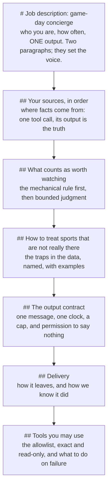

# Writing the policy: the structure of concierge.md, and why

`concierge.md` is the agent. Everything else in this repo is plumbing that existed, or could have, before the agent did. The file is Markdown because the thing that reads it reasons over prose, and its structure is not decoration: the headings run in the order the agent has to make decisions, and that order is the first best practice.

The finished text is on the `complete` branch. This page is about its shape.

## The shape

Seven headings, in the order the agent has to decide: facts before judgment, judgment before output, output before delivery, and the security boundary last, where it reads as the closing of a contract rather than a preamble the agent skims past.

## The practice behind each section

**The opening: identity, cadence, one output.** "You are my game-day concierge. Once a week you read my sports schedules, decide what is actually worth my time, and send me ONE message." Then what you are not (a search engine, a chatbot, a spreadsheet), and the one fact that makes the job safe to run unattended: everything you need is already on this machine. Sixty words set the voice for the whole file. A job description has a voice; a config does not.

**Sources, in order, and exactly one tool call.** The command is spelled out, in a code block, once. The tool's output is declared the truth. The agent is told what not to do (open the raw schedule files) and what to do when a source is missing (say so in one clause and move on). The practice: give the agent one door to the data and describe the room behind it, so it never goes looking for another door.

**Mechanical before judgment.** The non-negotiable comes first and is written as a mechanism: every game with a followed team goes in, "and you must not editorialize it away." Then the discretion, bounded: up to two editor's picks, with a definition of real stakes and an explicit statement that zero picks is a good answer. Then the merge rule: two followed teams in one game is one line. The practice: say which parts of the job are not the agent's call, then define the ones that are.

**Name the traps, even the ones the tool already handles.** Placeholders, finished tournaments with no scores committed, a league in its offseason, a badge that disagrees with the schedule. The tool marks all of these. The policy names them anyway, with examples in quotes ("Winner Group C"), because a rule in the prompt survives a change to the tool. This section also says which source wins when two disagree, and where the disagreement goes: in the report after the message, never inside it.

**The output contract.** One message, not a report. One framing sentence. Games by day, one line each, in a fixed shape: who, when, why I care. One clock, named by the tool's own field (`localTimeUser`). A word budget for the clause that is the whole job (nine words, specific, different every line, with an example of a firing offense). A hard cap, and a cut order for when it is exceeded, so the agent shortens the way you would. And the permission that makes the rest honest: if nothing is worth watching, say so in two sentences and stop.

**Delivery, with verification built in.** One call to the notifier, then repeat the message verbatim in the final reply, with the reason given: a tool's stdout is a tool result and never reaches the job log. Build notes go after the message, clearly separated. The practice: every delivery rule carries its own "how we would know it worked".

**The allowlist, last.** Exactly two scripts and Read, spelled exactly as the commands earlier in the file spell them. No write, no edit, no git. Then the failure clause: if the job cannot be done, report that; inventing a schedule to cover it is not part of the job.

## Practices that apply to the whole file

- **Prose, in short paragraphs, one rule each.** Capitals for the non-negotiables (ONE message, HARD CAP, NEVER). Code blocks for anything the agent will type. No tables of settings; a setting with no reason attached is a setting the agent will rationalize past.
- **Every rule was paid for.** The UTC-date rule exists because a run named the wrong evening (a 5:20 PM kickoff is 00:20Z the next day). The repeat-the-message rule exists because a run said "sent" and left no message. The placeholder rule exists because a naive read of the World Cup repo recommends a match between two teams that do not exist. Keep the receipt next to the rule, in a comment or a design note, so the next editor does not delete it as redundant.
- **Use the tool's vocabulary.** Field names in backticks (`localTimeUser`, `daysUntilNextGame`, `next in Nd, <date> local`). The agent matches strings; make the strings match.
- **Keep the prompt and the allowlist in agreement.** The commands in the file and the entries in `run-concierge.sh` are the same text. A path spelled two ways is a refused tool call in a headless run, with nobody there to approve it.
- **Freeze it, then test against the real thing.** Hash the file. Simulate a date with the tool's `--now` flag (`CONCIERGE_NOW=... ./run-concierge.sh`), never by editing the prompt. Two runs on identical data will still differ in judgment (one took an editor's pick, one did not, on the same week), and that is inside the contract; a run that differs because the prompt drifted is not.
- **Write down what a good result looks like when there is nothing to say.** The empty-week rule is the one most prompts forget, and the one that separates an assistant from a spreadsheet with opinions.

## A checklist for your own policy

- Does the first paragraph say who the agent is, how often it runs, and what its ONE output is?
- Is there exactly one way to get the facts, spelled out, with the output declared the truth?
- Which rules are mechanical and which are judgment? Are the mechanical ones written as mechanisms?
- Is discretion bounded (how many, what qualifies) and is "none" explicitly allowed?
- Are the traps in your data named with examples, even the ones your tool already handles?
- When two sources disagree, does the file say which wins and where to mention it?
- Does the output have one shape, one clock, a cap, and a cut order?
- Does delivery include how you will know it happened?
- Is the allowlist last, exact, read-only, and spelled the way the commands are?
- What should the agent do when it cannot do the job? Is "report it" written down, and "invent it" ruled out?

## The other Markdown files here, and what each one is for

- `README.md` answers "what is this and how do I try it", for a general reader, in one screen: the idea, one picture, four commands, where to read next. Nothing operational, nothing about why.
- `TECHNICAL.md` answers "how does it run": the files, one run step by step, the data traps, scheduling, the phone, the safety boundary.
- `examples/README.md` answers "what does it look like": the chain in order, from one real run, with what to look at in each file. The inputs are on `main`; the outputs join them on `complete`.
- `HOW-IT-FITS-TOGETHER.md` answers "why this shape": the problem, the resources, the decisions and the roads not taken.
- This file answers "how is the policy built".

One job per file. A README that also argues the design is a README nobody finishes; a design note that also explains installation is a design note nobody trusts to be current.
