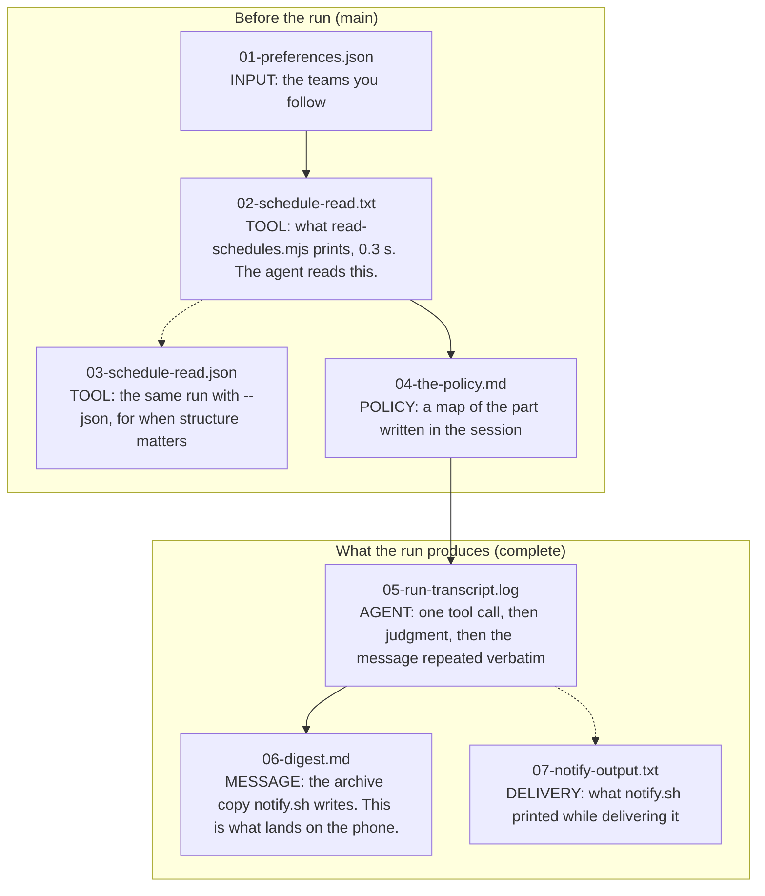

# The chain, file by file

Everything the concierge touches, in the order the data moves. Files 01 to 04 exist before the agent runs and are on the `main` branch. Files 05 to 07 are what the run produces and join this folder on the `complete` branch, next to the finished policy that produced them.

All of it comes from one real run on September 14, 2026, with the clock set to the week of the session (Wednesday, September 16 through Tuesday, September 22):

```
CONCIERGE_NOW=2026-09-16 ./run-concierge.sh
```

Committed schedules keep changing underneath these files (a Premier League fixture moved by a day between two runs twelve days apart), so a run on a later date will differ. That is the point of reading the schedule on the morning it matters instead of trusting a saved copy.



| # | File | Branch | What it is | What to look at |
|---|---|---|---|---|
| 01 | `01-preferences.json` | main | Input. Eleven teams, keyed by sport and abbreviation, each with a `why` note. A snapshot of `../preferences.json`, which you edit by hand or through `../preferences-editor.html` (the "Try the example" button on https://ismayc.github.io/never-miss-a-game/preferences-editor.html loads this same file). | The `why` lines. They are the raw material for the digest's "why I care" clauses, and the policy tells the agent to use them without repeating them. Compare them with the lines in 06. |
| 02 | `02-schedule-read.txt` | main | Tool output, text mode. Sources and their state, the followed teams with their next game, then every game in the window by day. About 8 KB. This is what the agent reads. | The SOURCES block: seven of ten are dormant, the World Cup repo carries 32 placeholder matches and 72 past matches with no result, and each caveat is printed rather than hidden. The FOLLOWED TEAMS block: `next in 34d, Tuesday, Oct 20` is a committed fact, already in your timezone. |
| 03 | `03-schedule-read.json` | main | Tool output, `--json`. The same run in machine shape, trimmed to the followed games (the full file is about 52 KB). | One `games[]` record: `status` carries every data caveat (scheduled, final, placeholder, past-unresolved), `localTime` is the sport's own clock and `localTimeUser` is one shared clock. One `followedTeams[]` record: `nextGameLocal` exists so nobody reads a date off a UTC timestamp. |
| 04 | `04-the-policy.md` | main | The part we write. A map of `../concierge.md`: what each section settles. On `main` that file is an outline; on `complete` it is the finished text. | The policy never parses data. It says what counts, what to ignore, and what one message looks like. |
| 05 | `05-run-transcript.log` | complete | Agent output. The headless run's transcript, exactly as `run-concierge.sh` wrote it. | The first line: "Sent. The message, verbatim:" is the repeat-the-message rule working. After the separator, the build notes the policy asks for: why one editor's pick and not two, the NBA badge saying 35 days while the per-team dates say 34 and 36, and the phone push skipped because no topic was set. The last three lines are the runner checking that a digest file exists, which is the only honest evidence that something was delivered. |
| 06 | `06-digest.md` | complete | The message. Written by `notify.sh` as its archive copy, with a title and a delivery timestamp on top. | One framing sentence. Fifteen lines, every one with a reason. Seahawks at Cardinals is ONE line because both teams are followed. The Nuggets and Spurs, who have nothing this week, get one closing line with their return dates. 1,891 bytes, under the 2,000-character cap. |
| 07 | `07-notify-output.txt` | complete | Delivery. What `notify.sh` printed while delivering 06: the boxed stdout copy, the archive line, and the phone push it skipped. The macOS banner it also raised leaves no trace in text. | This output is a tool result: the agent sees it, the job log never does. That is why the policy makes the agent repeat the message, and why `notify.sh` writes 06 to disk itself. |

The run behind these files took 89 seconds. Other runs of the same window have taken between 86 and 159 seconds, almost all of it between the tool call and the finished message.
